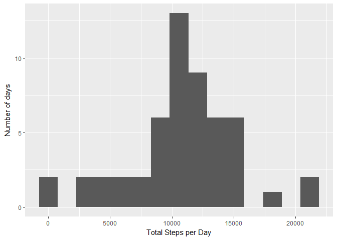
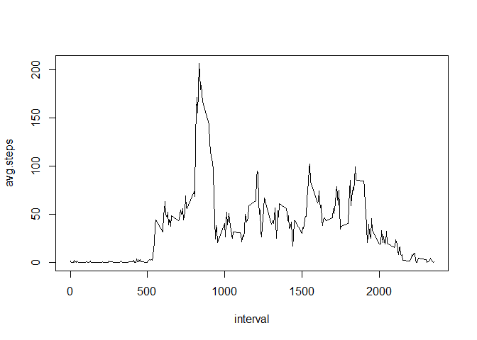
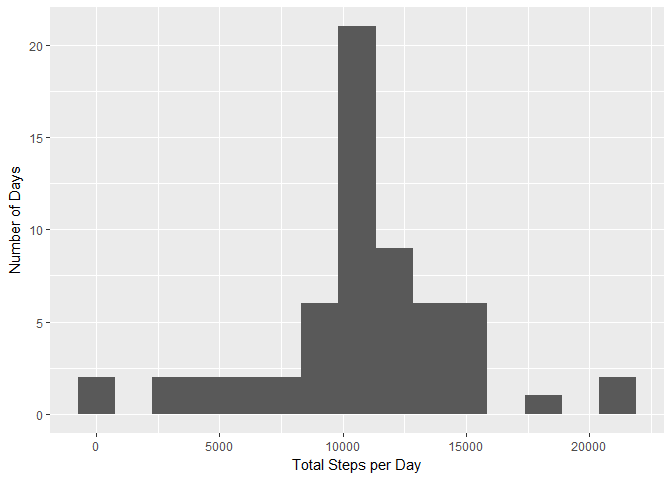
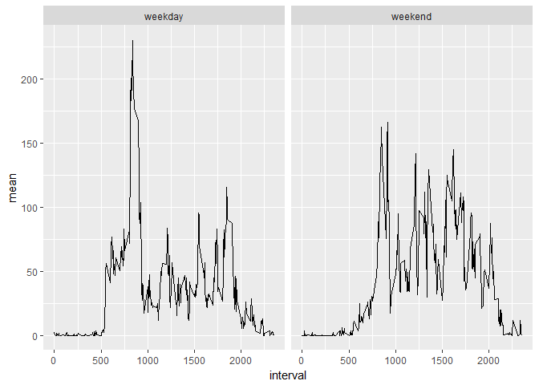

## Loading and preprocessing the data

The following creates a folder from the working directory called 'data' if it's not already there. Then it loads the zip file from the course website and unzips the file into the 'data' folder just created.

dplyr and ggplot2 libaries are required for this code

```r
library(dplyr)
library(ggplot2)
library(chron)
```

Loading and preprocessing code:

```r
#creates data subfolder in working directory
if(!file.exists("data"))
{
        dir.create("data")
}

#reads in file and unzips
fileUrl <- "https://d396qusza40orc.cloudfront.net/repdata%2Fdata%2Factivity.zip"
download.file(fileUrl, destfile = "./data/activity.zip")
unzip("./data/activity.zip", exdir = "./data")

#reads table and outputs basics
initdt <- read.table("./data/activity.csv", header=TRUE, sep=",", 
                     stringsAsFactors = FALSE)
dim(initdt)
```

```
## [1] 17568     3
```

```r
head(initdt)
```

```
##   steps       date interval
## 1    NA 2012-10-01        0
## 2    NA 2012-10-01        5
## 3    NA 2012-10-01       10
## 4    NA 2012-10-01       15
## 5    NA 2012-10-01       20
## 6    NA 2012-10-01       25
```

```r
str(initdt)
```

```
## 'data.frame':	17568 obs. of  3 variables:
##  $ steps   : int  NA NA NA NA NA NA NA NA NA NA ...
##  $ date    : chr  "2012-10-01" "2012-10-01" "2012-10-01" "2012-10-01" ...
##  $ interval: int  0 5 10 15 20 25 30 35 40 45 ...
```


## What is mean total number of steps taken per day?

###Q2. Mean total number of steps per day
This involves using tapply to split-apply-combine the data table to group and sum by date.

```r
#per assignment, ignore NA's
noNaDt <- filter(initdt, !is.na(steps))

#calculate total number of steps per day:
#use tapply to split noNaDt by date groups, apply sum to each and
#combine to dailySum
dailySum <- with(noNaDt, tapply(steps, date, sum))

#create histogram of daily steps per day
qplot(dailySum, bins = 15, ylab = "Number of days", xlab = "Total Steps per Day")
```

<!-- -->

```r
#calculate mean
mean(dailySum)
```

```
## [1] 10766.19
```

```r
#calculate median
median(dailySum)
```

```
## [1] 10765
```


## What is the average daily activity pattern?
###Q3. Average steps per interval over all days
Average daily pattern.


```r
#Q3. plot time-series average steps averaged for each interval
#need to aggregate by interval
intervalDt <- data.frame(with(noNaDt, tapply(steps, interval, mean)))
colnames(intervalDt) <- "avg.steps"

#add a column that matches the row names
intervalDt <- mutate(intervalDt, interval = rownames(intervalDt))

#plot line graph
with(intervalDt, plot(interval, avg.steps, type='l'))
```

<!-- -->

```r
#which interval has the maximum number of steps
intervalDt[intervalDt$avg.steps == max(intervalDt$avg.steps),2]
```

```
## [1] "835"
```


## Imputing missing values
###Q4 imputing missing values
In this section, the code calculates the number of NA's. Then it merges intervalDt to initdt in order to line up the average steps each interval over all days against the NA's. It then replaces the NA's with those averages.


```r
#Q4 imputing data
#determining number of NA's
nrow(filter(initdt, is.na(steps)))
```

```
## [1] 2304
```

```r
#imputing strategy: use daily average for each interval to fill in NA's
#merge intervalDt to initdt to get the daily average steps per interval
#in another column

mergeDt <- merge(initdt, intervalDt, by ="interval")

#sort by date then interval
mergeDt <- arrange(mergeDt, date, interval)

#replace NA's with daily avg.steps. is.na(mergeDt$steps) is a boolean vector
#that shows TRUE every time there is a NA in the steps column. It can be
#applied to the mergeDt$avg.steps column to match the right avg steps
#with the right interval that has the NA.
mergeDt$steps[is.na(mergeDt$steps)] <- mergeDt$avg.steps[is.na(mergeDt$steps)]

#histogram of the imputed data set, steps per day
imputeDailySum <- with(mergeDt, tapply(steps, date, sum))

qplot(imputeDailySum, bins=15, ylab = "Number of Days", xlab = "Total Steps per Day")
```

<!-- -->

```r
#calculate mean and median
mean(imputeDailySum)
```

```
## [1] 10766.19
```

```r
median(imputeDailySum)
```

```
## [1] 10766.19
```
...so the mean did not change but the median did, with the addition of the imputed values. The resultant imputing of the data reinforced the mean and median.


## Are there differences in activity patterns between weekdays and weekends?
###Q5. Average differences between weekdays and weekends by interval


```r
#Question 5. differences between weekday and weekend
#use mutate to add a column that differentiates between weekday and weekend
wkndDt <- mutate(mergeDt, wknd = as.factor(ifelse(is.weekend(date),
                                                  "weekend","weekday")))

#use dplyr functions to group and summarize the mean
groups <- wkndDt %>%
        group_by(wknd,interval) %>%
        summarise(mean = mean(steps))

#plot the differences using facets by weekday and weekend
qplot(interval, mean, data = groups, geom = 'line', facets=.~wknd)
```

<!-- -->

